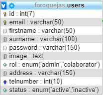
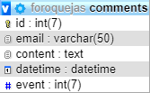
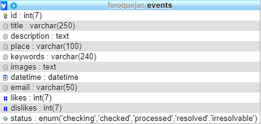
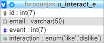
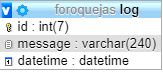
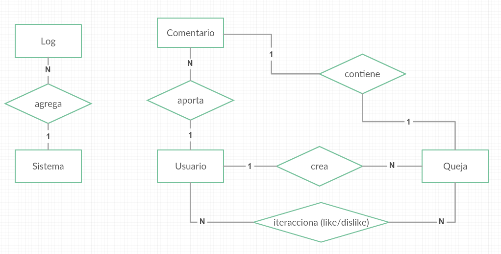
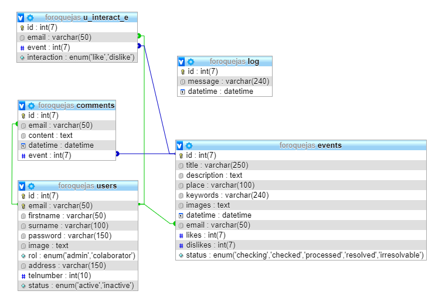

# Foroquejas - Foro de quejas

Esto es un foro para quejarse.

## Introducción

El proyecto está íntegramente desarrollado utilizando las siguientes tecnologías y lenguajes:

1. PHP
2. HTML
3. CSS
4. Bootstrap
5. Twig
6. PDO
7. JavaScript
8. JQuery
9. Highcharts
10. Font Awesome
11. Arquitectura MVC
12. SQL

## Diseño
El diseño de Foroquejas está inspirado en otros foros de internet, como es [Forocoches](https://www.forocoches.com/), [Invertia](https://www.invertia.com/es/foros) o [3DJuegos](https://www.3djuegos.com/foros/). En particular, los foros que ofrecen el contenido en forma de listados me parecen más atractivos y funcionales, por lo que he intentado que Foroquejas sea así.

En cuanto a mockups, wireframe y demás, no he creado gran cosa, salvo algún boceto muy básico para intentar ordenar ideas y elementos en mi cabeza. He intentado por encima de todo que la estética general sea lo más limpia posible, evitando sobrecargar con elementos innecesarios la interfaz.

Por otro lado he agregado algunas estadísticas (usando JS y Highcharts), algo que creo que queda curioso y que permite visualizar el contenido general que hay en el foro.

## Usuarios del sistema

Por defecto siempre hay dos usuarios en el sistema, un administrador y uno anónimo.

#### Usuarios administradores

Tienen control total del sistema. Son los únicos que pueden crear otros usuarios.

Usuario: admin@admin
Pass: admin
Status: activo

Usuario: faust@foroquejas.es
Pass: faust
Status: activo

#### Usuarios colaboradores

Sólo pueden agregar nuevas quejas, comentar y dar like/dislike.

Usuario: pacolozano@email.es
Pass: pacolozano
Status: activo

Usuario: lisamona@email.es
Pass: lisamona
Status: activo

Usuario: goku@email.es
Pass: goku
Status: activo

Usuario: ratita@email.es
Pass: ratita
Status: inactivo

Usuario: juanma@email.es
Pass: juanma
Status: inactivo

Usuario: mariano@email.es
Pass: mariano
Status: activo

#### Usuario anónimo

Este usuario permite controlar de manera más sencilla qué pueden o no hacer los usuarios anónimos que visitan el sitio. No puede acceder al sitio web ni tampoco puede crear nuevas quejas. Por otro lado facilita también la extracción de datos estadísticos.

Usuario: anonymous@anonymous
Pass: anonymous

## Base de datos

Foroquejas cuenta con una base de datos con cinco tablas. Son:

#### ‘users’

#### ‘comments’

#### ‘events’ (Quejas)

#### ‘u_interact_e’ (Likes y dislikes)

#### ‘log’

#### Modelo entidad-relación

#### Modelo relacional

#### Datos .sql
Se adjuntan dos archivos SQL, uno de ellos cuenta con datos (quejas, comentarios…) mientras que el otro tiene los datos mínimos de la base de datos.

En cuanto a la gestión de base de datos: El botón “Vaciar BBDD” elimina todos los datos, dejando sólo los usuarios mínimos necesarios.

## Controladores

He implementado siete controladores para manejar el sitio web. Son los siguientes:

- Admin: Todo lo relacionado a la administración de Foroquejas. Agregar, editar y eliminar usuarios, log y gestión de BBDD.  
- Error: Usado para mostrar una ventana de error si la URL es incorrecta.
- Events: Gestión de quejas, likes/dislikes y comentarios.
- Login: Validación de usuarios.  
- Main: Página principal del sitio web.
- Profile: Perfil personal, obtención de datos (comentarios, quejas, likes/dislikes) y modificación del perfil.
- Users: Usado para obtener estadísticas del sitio web. No tiene páginas como tal, sino que devuelve objetos JSON.

## Modelos

Utilizo cinco modelos para manejar las cinco tablas de la base de datos. Son los siguientes:

- Admin: Usado para todas las consultas necesarias para la gestión de BBDD.
- Comment: Consultas sobre eventos y estadísticos de estos.
- Event: Consultas para las quejas, likes, dislikes, búsqueda y estadísticos.
- Log: Funciones para el log del sistema.
- User: Todo tipo de consultas para gestionar los usuarios y sus estadísticos.
